# Rapid Triage

**Rapid Triage** is an offline-first Flutter application designed for emergency medical personnel to capture patient triage information in challenging network environments. Built for paramedics working in disaster zones, rural areas, or any location with unreliable connectivity, it ensures that critical patient data is never lost. The app automatically synchronizes locally stored records with a backend server the moment a stable internet connection is restored.

---

# 🎥 App Demonstration

This section provides a walkthrough of the core offline-first workflow.

## Demonstration Video

https://drive.google.com/file/d/1-0IyBe11sFrS4-I1qehj39lS-hSWxXvF/view?usp=sharing

The demonstration video and screenshots illustrate the following flow:

1. User logs in using the fake authentication screen.
2. User creates multiple triage records (with varying severity).
3. Device is switched to **Airplane Mode** (network disabled).
4. Records continue to be saved locally; the pending sync count increments.
5. Airplane Mode is disabled, restoring connectivity.
6. Background sync starts automatically without user interaction.
7. Pending records become **Synced**, as shown in Sync History.

## Screenshots

The intended flow, from launch to configuration:

<table>
<tr>
<td align="center" width="33%">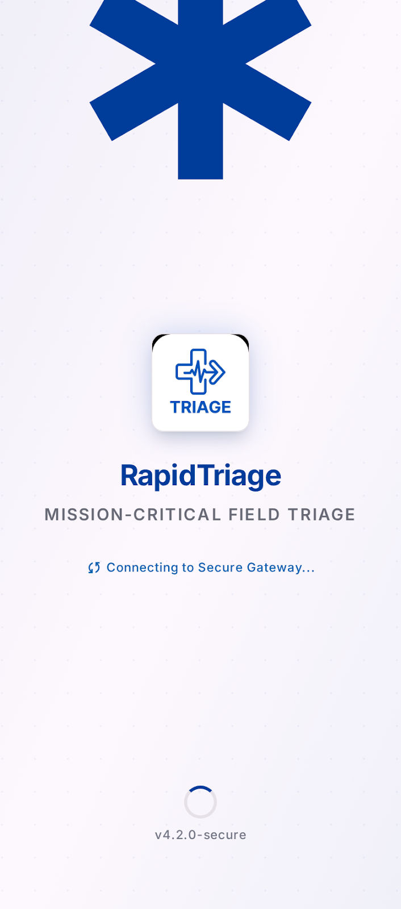<br/><sub><b>1. Splash Screen</b></sub></td>
<td align="center" width="33%">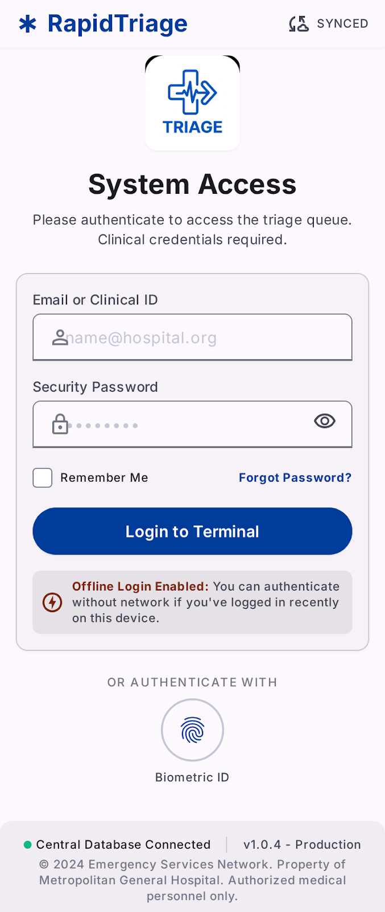<br/><sub><b>2. Login</b></sub></td>
<td align="center" width="33%">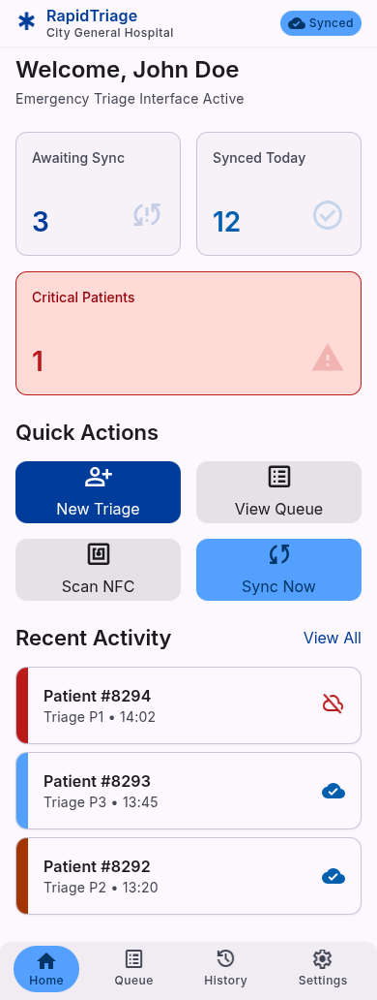<br/><sub><b>3. Home Dashboard</b></sub></td>
</tr>
<tr>
<td align="center">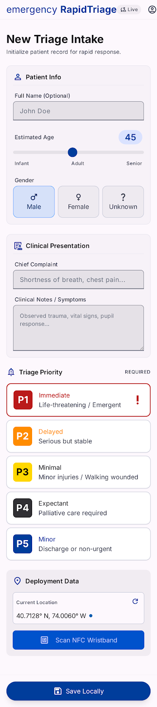<br/><sub><b>4. New Triage Intake</b></sub></td>
<td align="center">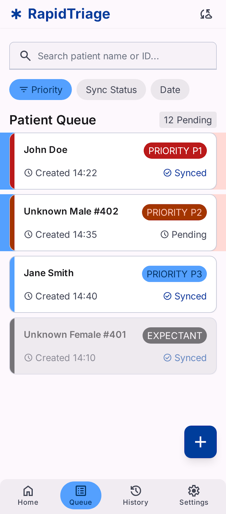<br/><sub><b>5. Patient Queue</b></sub></td>
<td align="center">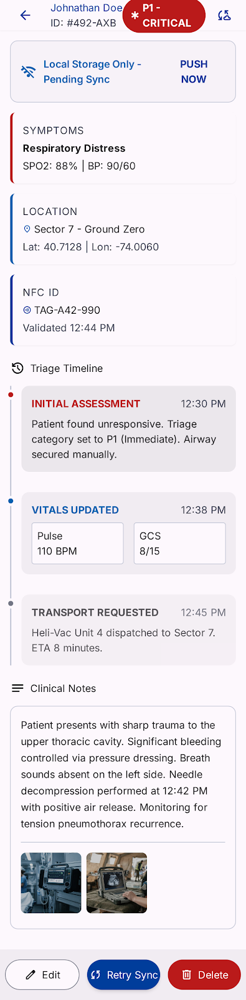<br/><sub><b>6. Patient Details</b></sub></td>
</tr>
<tr>
<td align="center">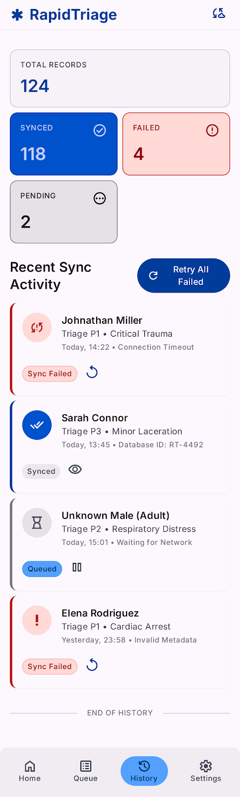<br/><sub><b>7. Sync History</b></sub></td>
<td align="center">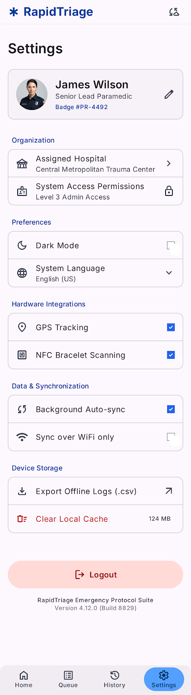<br/><sub><b>8. Settings</b></sub></td>
<td align="center">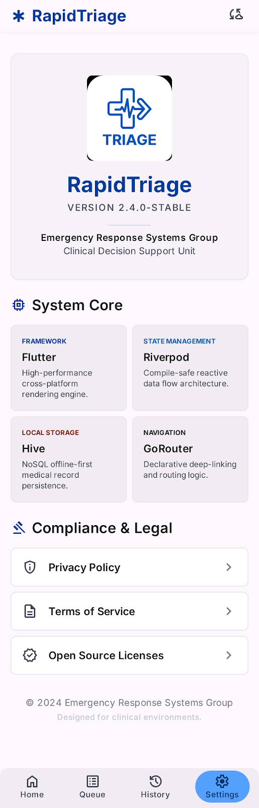<br/><sub><b>9. About</b></sub></td>
</tr>
</table>

---

# Features

- ✅ **Offline-first architecture** – fully functional without internet access
- 📦 **Local Hive persistence** – instant, reliable storage on device
- 🔄 **Automatic background synchronization** – syncs when connectivity returns
- 🔐 **Fake authentication** – demonstration login flow
- 🏥 **Patient triage workflow** – capture severity, symptoms, vitals
- 👥 **Patient queue** – prioritize by triage category
- 📊 **Dashboard** – overview of patients, sync status
- 📜 **Sync history** – view sync events and pending records
- 👤 **Patient details** – full patient record view
- 📍 **GPS location support** – capture triage location
- 📡 **NFC-ready architecture** – extensible for NFC scanning
- 🧠 **Riverpod state management** – scalable, testable
- 🧭 **GoRouter navigation** – declarative routing
- 🎨 **Professional Material 3 UI** – modern, adaptive
- 📱 **Responsive design** – works on phones and tablets
- 🌐 **Automatic connectivity monitoring** – reacts to network changes

---

# Screens

| Screen              | Purpose                                                                       |
| ------------------- | ----------------------------------------------------------------------------- |
| **Splash**          | Displays app branding and checks initial connectivity                         |
| **Login**           | Fake authentication screen (demonstration login)                              |
| **Dashboard**       | Summary of patients, pending syncs, quick actions                             |
| **New Triage**      | Form to capture patient triage data (name, age, severity, symptoms, location) |
| **Patient Queue**   | List of triaged patients sorted by severity                                   |
| **Patient Details** | Full detailed view of a single patient record                                 |
| **Sync History**    | Log of sync operations and current pending/failed records                     |
| **Settings**        | App configuration (theme, notifications, sync preferences)                    |
| **About**           | Application version, credits, and links                                       |

---

# Architecture

The application follows a **Clean Architecture** approach with three layers:

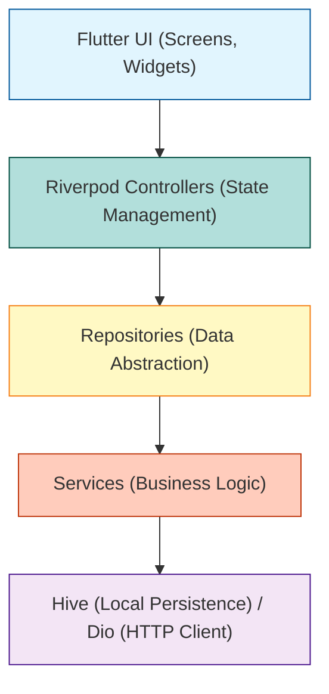

- **Flutter UI**: Stateless and Stateful widgets; pages and reusable components.
- **Riverpod Controllers**: Business logic and state; providers manage data and expose it to UI.
- **Repositories**: Interface between controllers and data sources; decide whether to fetch local or remote.
- **Services**: Lower-level operations like API calls, Hive reads/writes, connectivity checks.
- **Hive / Dio**: Persistence layer (Hive) and network layer (Dio for future backend).

---

# Folder Structure

```
lib/
├── app/                       # App-level configuration, router, providers, initializer
│   ├── app.dart
│   ├── app_initializer.dart
│   ├── app_providers.dart
│   └── app_router.dart
├── core/                      # Shared infrastructure across features
│   ├── constants/             # App constants
│   ├── services/              # Global services (connectivity, hive, api, location, etc.)
│   ├── theme/                 # Material 3 theming (colors, typography, spacing)
│   ├── utils/                 # Utility classes and helpers
│   └── widgets/               # Reusable generic widgets (loading, error, offline banner)
├── features/                  # Feature modules
│   ├── auth/                  # Authentication (fake auth, login screen)
│   ├── splash/                # Splash screen
│   └── triage/                # Core triage functionality
│       ├── controllers/       # Riverpod controllers for each screen
│       ├── models/            # Data models (TriageRecord, Patient, Location)
│       ├── repositories/      # Data repository (triage_repository)
│       ├── screens/           # Screen implementations
│       │   ├── about/
│       │   ├── history/
│       │   ├── home/
│       │   ├── intake/
│       │   ├── patient/
│       │   ├── queue/
│       │   └── settings/
│       └── widgets/           # Feature-specific widgets (shared UI components)
│           └── shared/
└── main.dart                  # Entry point
```

**Folder responsibilities**:

- **`app/`**: Application bootstrap, route configuration, global providers.
- **`core/`**: Cross-cutting concerns; services like `HiveService`, `ConnectivityService`, theming, and reusable widgets.
- **`features/`**: Each feature is self-contained with its own controllers, models, screens, and widgets, promoting separation of concerns.
- **`features/triage/`**: Contains the bulk of domain logic for patient triage.

---

# Technology Stack

| Technology            | Purpose                                                  |
| --------------------- | -------------------------------------------------------- |
| **Flutter**           | Cross-platform UI framework (Android, iOS, Web, Desktop) |
| **Riverpod**          | State management and dependency injection                |
| **Hive**              | Fast, lightweight local NoSQL storage                    |
| **Dio**               | HTTP client for future backend communication             |
| **GoRouter**          | Declarative, type-safe routing                           |
| **Geolocator**        | GPS location capture for triage records                  |
| **UUID**              | Generate unique IDs for records                          |
| **Connectivity Plus** | Network status monitoring                                |
| **Material 3**        | Modern design system with dynamic theming                |

---

# Project Structure

- **Controllers**: Riverpod providers that manage screen state (e.g., `IntakeController`, `QueueController`, `SyncController`).
- **Repositories**: Abstract data access; `TriageRepository` decides whether to read/write locally or eventually call the API.
- **Models**: Plain Dart classes with JSON serialization (e.g., `TriageRecord`, `Patient`, `Location`).
- **Services**: Perform actual work – `HiveService` manages local DB, `SyncService` handles background sync, `ConnectivityService` monitors network.
- **Widgets**: Reusable UI components scoped to a feature (e.g., `PatientCard`, `PriorityBadge`, `DashboardCard`).
- **Core**: Shared widgets and utilities (e.g., `OfflineBanner`, `LoadingIndicator`, `ErrorStateWidget`, `EmptyStateWidget`).

---

# Offline-First Workflow

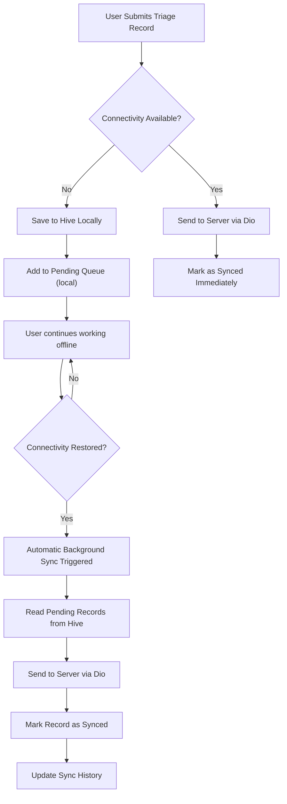

**How it works**:

1. User fills in triage form and taps submit.
2. `ConnectivityService` checks network status.
3. If **online**: record is sent to the server via Dio; marked as _Synced_ immediately.
4. If **offline**: record is saved to local Hive storage and added to a pending queue. The dashboard shows pending count.
5. The app continues to function fully offline, all records go to the pending queue.
6. When connectivity is restored (e.g., Airplane Mode disabled), `SyncService` is triggered automatically.
7. Pending records are read from Hive one by one, sent to the server, and marked as _Synced_.
8. Sync history is updated with success/failure status.

---

# Data Model

## `TriageRecord`

| Field              | Type             | Description                       |
| ------------------ | ---------------- | --------------------------------- |
| `id`               | `String`         | UUID                              |
| `patient`          | `Patient`        | Embedded patient information      |
| `severity`         | `TriageCategory` | `Red`, `Yellow`, `Green`, `Black` |
| `chiefComplaint`   | `String`         | Primary symptom or complaint      |
| `symptoms`         | `List<String>`   | List of symptoms                  |
| `bloodPressure`    | `String?`        | Systolic/Diastolic                |
| `heartRate`        | `int?`           | Beats per minute                  |
| `respiratoryRate`  | `int?`           | Breaths per minute                |
| `oxygenSaturation` | `double?`        | SpO₂ percentage                   |
| `temperature`      | `double?`        | Celsius                           |
| `notes`            | `String?`        | Additional observations           |
| `location`         | `Location?`      | GPS coordinates and address       |
| `createdAt`        | `DateTime`       | Timestamp of creation             |
| `updatedAt`        | `DateTime`       | Timestamp of last update          |
| `syncStatus`       | `SyncStatus`     | `pending`, `synced`, `failed`     |

## `Patient`

| Field           | Type        | Description          |
| --------------- | ----------- | -------------------- |
| `firstName`     | `String`    | Patient's first name |
| `lastName`      | `String`    | Patient's last name  |
| `dateOfBirth`   | `DateTime?` | Date of birth        |
| `gender`        | `String?`   | Gender               |
| `contactNumber` | `String?`   | Phone number         |
| `address`       | `String?`   | Home address         |

## `Location`

| Field       | Type      | Description            |
| ----------- | --------- | ---------------------- |
| `latitude`  | `double`  | Latitude               |
| `longitude` | `double`  | Longitude              |
| `address`   | `String?` | Human-readable address |

---

# Setup Instructions

### Prerequisites

- Flutter SDK **3.12+** (stable channel)
- Dart SDK (included with Flutter)
- Android Studio / VS Code with Flutter extension
- A physical device or emulator

### Steps

```bash
# 1. Clone the repository
git clone https://github.com/eddgachi/flutter_rapid_triage.git
cd flutter_rapid_triage

# 2. Install dependencies
flutter pub get

# 3. Run the app
flutter run
```

No API keys are required; the app uses fake authentication and stores data locally.

---

# Building APK

```bash
# Build a release APK for Android
flutter build apk --release

# Build an App Bundle for Play Store
flutter build appbundle --release
```

The generated APK will be located at `build/app/outputs/flutter-apk/app-release.apk`.

---

# Future Improvements

- 🔐 **Real authentication** with JWT and role-based access
- 🌐 **REST backend** (Node.js / Firebase) for persistent storage
- 📲 **Push notifications** for critical updates
- ⏰ **Background workers** (WorkManager) for reliable sync
- 🗺️ **Maps integration** for geospatial triage view
- 📖 **Real NFC scanning** for patient ID cards
- 👁️ **Biometric authentication** (fingerprint / face)
- 🔒 **Encryption** of local Hive data (AES-256)

---

# Requirements Mapping

| Requirement                 | How It Is Satisfied                               |
| --------------------------- | ------------------------------------------------- |
| Offline-first design        | App works fully offline, records saved to Hive    |
| Automatic sync on reconnect | `ConnectivityService` triggers `SyncService`      |
| Local persistence           | Hive stores `TriageRecord` objects                |
| Riverpod state management   | All controllers use Riverpod providers            |
| GoRouter navigation         | Declarative routing with named routes             |
| Material 3 UI               | Custom theme using Material 3 color system        |
| Fake authentication         | `FakeAuthService` with login screen               |
| Triage workflow             | Intake screen → Queue → Details                   |
| GPS location                | `GeolocatorService` captures coordinates          |
| Connectivity monitoring     | `ConnectivityPlus` wrapper with state stream      |
| Multi-screen navigation     | Tab-based navigation with bottom nav bar          |
| Code generation             | Build runner for JSON serialization               |
| Clean Architecture          | Separation into controllers/repositories/services |

---

# Author

**GitHub:** [github.com/eddgachi](https://github.com/eddgachi)
